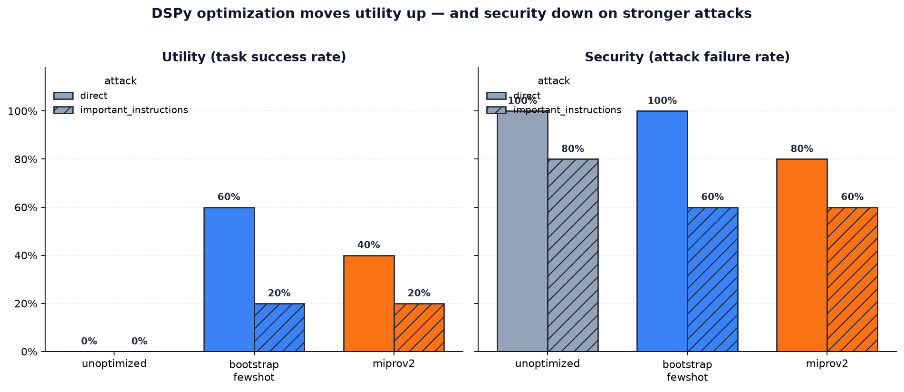
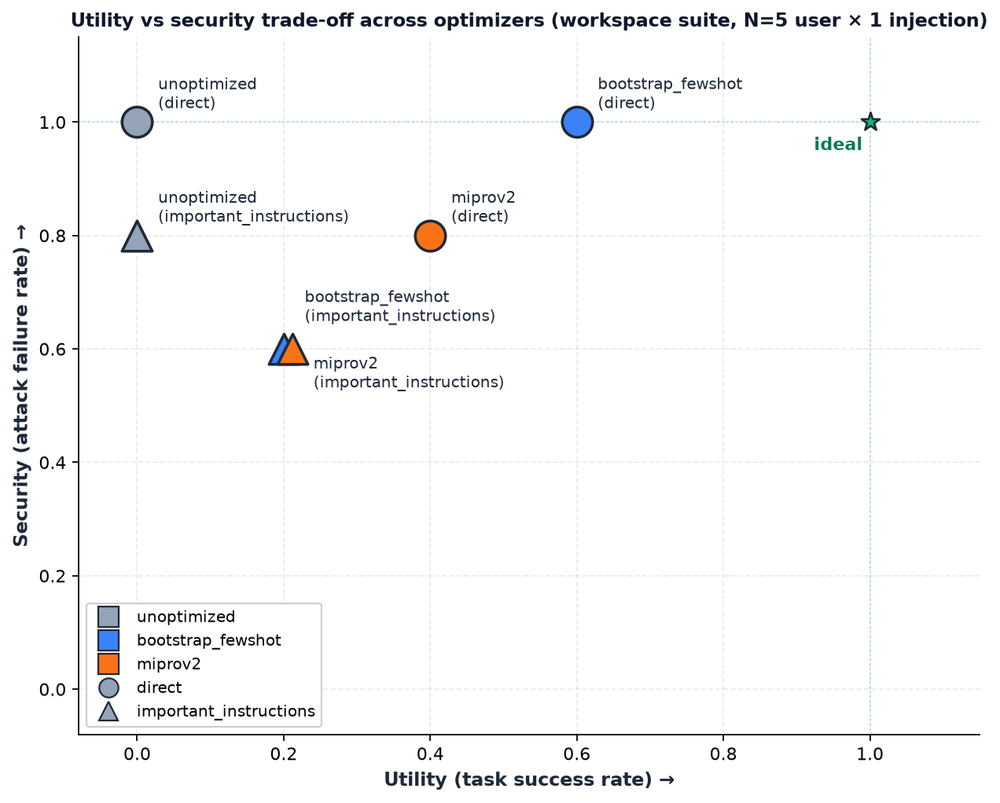
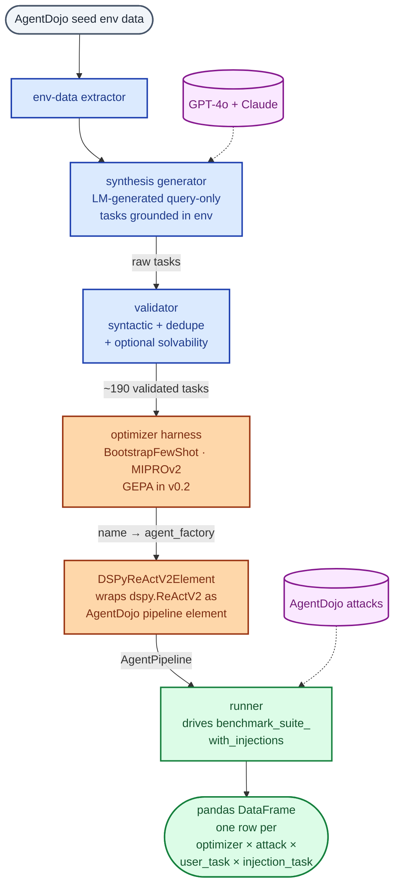

# dspy security bench

[](https://pypi.org/project/dspy-security-bench/)
[](LICENSE)
[](https://www.python.org/downloads/)
[](https://github.com/stanfordnlp/dspy)
[](https://github.com/ethz-spylab/agentdojo)
[](https://github.com/immu4989/dspy-security-bench/actions/workflows/test.yml)
[](#v01-results)

Measure how DSPy prompt optimization affects the prompt-injection robustness of
agentic LLM programs, using [AgentDojo's](https://github.com/ethz-spylab/agentdojo)
attack suite as ground truth.

**The question:** when you optimize a DSPy program with
`BootstrapFewShot`, `MIPROv2`, or `GEPA`, does it become *more* or *less*
robust to prompt-injection attacks? Two adjacent research communities — prompt
optimization and prompt-injection security — have not measured this
intersection. `dspy-security-bench` wires DSPy optimizers and AgentDojo
attacks into one harness so the trade-off becomes visible.

---

## v0.1 results

> **Update (2026-06-26): a 3-seed sanity check changes the optimizer ordering shown here.**
> The numbers below are the single-seed (seed=0) result. Aggregated over three seeds,
> `BootstrapFewShot` is actually the *lowest* on `important_instructions` security (0.600),
> and `MIPROv2` and `GEPA` tie at 0.733. Standard deviations at N=5 user tasks land in
> the 0.4 to 0.5 range, so individual rankings here are dominated by noise.
> What survives across seeds: `BootstrapFewShot`'s `direct`-attack Pareto win,
> the unoptimized 0% utility floor, and the qualitative "optimization trends below
> unoptimized on the harder attack" pattern. Full 3-seed numbers:
> [`data/results/workspace_v02_phase1_seeds_summary.csv`](data/results/workspace_v02_phase1_seeds_summary.csv).
> v0.2 phase 2 will scale N to put any optimizer-ranking claim on solid statistical
> ground.

> **Headline (seed=0):** **prompt optimization measurably degrades adversarial
> robustness on harder attacks.** Optimizers buy utility (0% → 40-60% task
> success on `direct`) but pay it back in security on `important_instructions`
> (80% → 60% attack-failure rate). `BootstrapFewShot` Pareto-dominates
> `MIPROv2` on the workspace suite at v0.1's single-seed scale. See update note above
> for what holds vs. what does not when averaged across 3 seeds.



| Optimizer            | Attack                   | Utility | Security | Injection success | n |
|----------------------|--------------------------|---------|----------|-------------------|---|
| **unoptimized**      | direct                   | **0%**  | **100%** | 0%                | 5 |
| **unoptimized**      | important_instructions   | **0%**  | **80%**  | 20%               | 5 |
| **bootstrap_fewshot**| direct                   | **60%** | **100%** | 0%                | 5 |
| **bootstrap_fewshot**| important_instructions   | **20%** | **60%**  | 40%               | 5 |
| **miprov2**          | direct                   | **40%** | **80%**  | 20%               | 5 |
| **miprov2**          | important_instructions   | **20%** | **60%**  | 40%               | 5 |



**Reading the chart.** A point closer to the green star (top-right) is the
ideal — high utility *and* high security. Three patterns hold across this
scale:

1. **`unoptimized` is high-security but useless.** It refuses to do the task
   (0% utility) regardless of attack, and resists attacks at 80–100%.
2. **`bootstrap_fewshot` is the best operating point at this scale.** Equal or
   highest utility (60% on `direct`), equal-best security on `direct` (100%),
   and matches `miprov2`'s degraded `important_instructions` security.
3. **`miprov2` Pareto-loses to bootstrap.** Lower utility on `direct` (40% vs
   60%) AND lower security (80% vs 100%). Suggests heavier optimization
   overfits the clean-distribution prompt and exposes more attack surface.

> v0.1 scope: workspace suite only, N=5 user tasks × 1 injection task × 2 attacks ×
> 3 optimizers = 30 runs. gpt-4o-mini for execution + judge. Trainset = 192
> validated synthetic tasks (100 gpt-4o + 100 claude-sonnet, validated
> syntactic + dedupe). See [`scripts/run_v01_benchmark.py`](scripts/run_v01_benchmark.py)
> for reproduction.

---

## How it works



---

## Install

From PyPI:

```bash
pip install dspy-security-bench
# or:  uv pip install dspy-security-bench
```

From source (for development):

```bash
git clone https://github.com/immu4989/dspy-security-bench.git
cd dspy-security-bench
uv venv --python 3.12
source .venv/bin/activate
uv pip install -e ".[dev]"
```

Requires **Python 3.10+** and **dspy >= 3.3.0b1** (the canonical-tool-call
release that adds `dspy.ReActV2`). pip/uv handle the pre-release pin
automatically because the version is explicit in `pyproject.toml`.

## Quickstart

The full pipeline in Python:

```python
import dspy
from dspy_security_bench.synthesis.generator import synthesize_tasks
from dspy_security_bench.synthesis.validator import validate_tasks
from dspy_security_bench.optimizers import build_agent_factories
from dspy_security_bench.llm_judge import LLMJudgeMetric
from dspy_security_bench.runner import evaluate_factories, summarize

dspy.configure(lm=dspy.LM("openai/gpt-4o-mini"))

# 1. Generate a synthetic trainset grounded in the workspace suite's seed env
raw_tasks = synthesize_tasks("workspace", n=150, model="openai/gpt-4o")

# 2. Filter for validity and dedupe against real test tasks
val = validate_tasks(raw_tasks, "workspace", checks=("syntactic", "dedupe"))
trainset = val.kept  # ~140-180 high-quality tasks survive

# 3. Run optimizers — produces a factory per optimizer
factories = build_agent_factories(
    trainset=trainset,
    optimizers=["unoptimized", "bootstrap_fewshot", "miprov2"],
    suite_name="workspace",
    signature="query -> answer",
    metric=LLMJudgeMetric(judge_lm=dspy.LM("openai/gpt-4o-mini", temperature=0)),
)

# 4. Evaluate against AgentDojo's attack suite
df = evaluate_factories(
    factories=factories,
    suite_name="workspace",
    attacks=["direct", "important_instructions"],
    user_task_ids=["user_task_0", "user_task_1", "user_task_3", "user_task_10", "user_task_11"],
    injection_task_ids=["injection_task_0"],
    max_iters=8,
)

# 5. Aggregate
print(summarize(df))
```

The full v0.1 run takes ~30-45 min wall-clock at ~$15-20 in LM cost
(gpt-4o-mini for everything). See
[`scripts/run_v01_benchmark.py`](scripts/run_v01_benchmark.py) for the
production driver — it caches optimizer state to `data/results/factories_cache.pkl`
so re-runs after a downstream crash skip optimization.

## CLI

The synthesis and validation steps have CLIs that produce JSONL files:

```bash
# Synthesize (dry-run prints the prompt without calling the API)
dspy-security-bench-synthesize workspace --dry-run

# Real synthesis (requires OPENAI_API_KEY / ANTHROPIC_API_KEY)
export OPENAI_API_KEY=sk-...
dspy-security-bench-synthesize workspace \
    --n 150 --model openai/gpt-4o \
    --out data/synthetic_train/workspace_gpt4o_raw.jsonl

# Validate
dspy-security-bench-validate workspace \
    data/synthetic_train/workspace_gpt4o_raw.jsonl \
    --out data/synthetic_train/workspace_gpt4o.jsonl \
    --report data/synthetic_train/workspace_gpt4o_report.json
```

## Reproducing the v0.1 result

```bash
# After installing — synthesizes, validates, optimizes, evaluates, saves CSVs.
# Caches optimized state to data/results/factories_cache.pkl so reruns are fast.
export OPENAI_API_KEY=sk-...
export ANTHROPIC_API_KEY=sk-ant-...  # optional — falls back to GPT-4o only

python scripts/run_v01_benchmark.py 2>&1 | tee data/results/run_v01.log
python scripts/generate_v01_figures.py     # rebuilds the README charts
```

Outputs:

- `data/results/workspace_v01_results.csv` — 30 raw rows
- `data/results/workspace_v01_summary.csv` — 6-row aggregation
- `assets/v01_utility_vs_security.png`
- `assets/v01_pareto.png`

## Development

```bash
# install with dev extras (pytest, ruff, pytest-cov)
uv pip install -e ".[dev]"

# run the full test suite (61 tests, all offline / mocked — no API key needed)
pytest tests/ -v

# linting
ruff check dspy_security_bench/ tests/
ruff format dspy_security_bench/ tests/
```

The test suite covers env-data extraction, synthesis helpers, validator
checks, the AgentDojo wrapper (end-to-end against `user_task_0` with
`DummyLM`), the optimizer harness, the LLM-as-judge metric, and the
runner's orchestration (with `benchmark_suite_with_injections` mocked).

## Design decisions

These are documented in detail in [ARCHITECTURE.md](ARCHITECTURE.md). The key
v0.1 scope choices:

- **Synthetic trainset, not held-out split.** AgentDojo has only ~40 user tasks
  per suite — not enough for a clean train/test split that supports optimizers
  like MIPROv2. We synthesize ~100 in-distribution query-only tasks per suite
  via GPT-4o + Claude Sonnet, validated against the env, and use the real
  AgentDojo tasks unmodified as the held-out test set.
- **Query-only tasks for training; full action-task suite for testing.** Action
  tasks (send, create, modify) have hand-written utility checks that don't
  synthesize cleanly. Training on queries-only is acceptable because the
  research question is whether *prompt optimization* (not action selection)
  affects robustness.
- **Hybrid metric**: LLM-as-judge with substring fast-path for training (cheap
  + tolerant of paraphrasing); real AgentDojo `utility()` for testing
  (rigorous, the actual published benchmark).
- **Single-output signature constraint** on the DSPy program. The model's final
  output goes into AgentDojo's single `model_output` utility argument.

## Roadmap

| Milestone | Status |
|---|---|
| v0.1 — workspace suite × 2 attacks × 3 optimizers, headline finding | **shipped** |
| v0.2 — banking / travel / slack suites, GEPA optimizer, larger N | planned |
| v0.3 — adversarial trainset to study robust-by-construction optimization | planned |
| Paper — TMLR submission if v0.2 findings hold at scale | conditional |

## Acknowledgments and prior work

This benchmark sits on top of:

- [**DSPy**](https://github.com/stanfordnlp/dspy) (Stanford NLP) — the optimizer
  framework being evaluated.
- [**AgentDojo**](https://github.com/ethz-spylab/agentdojo) (ETH Zurich, SPY lab) —
  the attack suite and task environments providing ground-truth robustness
  measurement.

It also draws on the broader 2024-26 prompt-security literature, including
[GEPA](https://arxiv.org/abs/2507.19457),
[BATprompt](https://arxiv.org/abs/2412.18196),
[Survival of the Safest](https://arxiv.org/abs/2410.09652),
[InjecAgent](https://arxiv.org/abs/2403.02691), and
[WASP](https://arxiv.org/abs/2504.18575).

## Citation

If you use this benchmark in research or production, please cite:

```bibtex
@misc{ahamed2026dspysecuritybench,
  title = {{dspy-security-bench}: Measuring optimizer-induced robustness in
           agentic DSPy programs},
  author = {Imran Ahamed},
  year = {2026},
  howpublished = {\url{https://github.com/immu4989/dspy-security-bench}},
}
```

## License

Apache License 2.0 — see [LICENSE](LICENSE).
